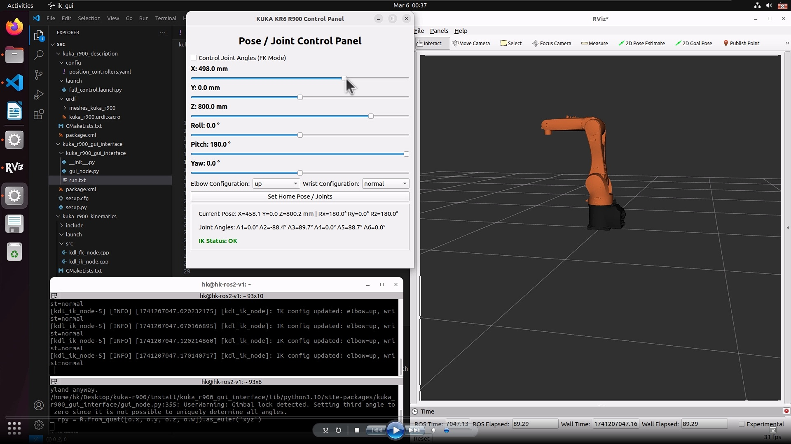

#### 🦾 KUKA KR6 R900 – Inverse Kinematics + Real-Time GUI Control in ROS 2

A complete real-time inverse kinematics control system for the **KUKA KR6 R900 sixx** industrial robot, built in **ROS 2**, with:
- Modular IK and FK using **KDL**;
- Live **PyQt5 GUI** with Cartesian + Joint control;
- Full integration with `ros2_control` for trajectory execution;
- Real-time **feedback**, visualization, and mode switching.



### 📌 Features

- Modular **Inverse Kinematics (IK)** using KDL;  
- Real-time **Forward Kinematics (FK)** feedback;  
- PyQt5 GUI for both **Cartesian (XYZABC)** and **Joint (A1–A6)** control;  
- **ros2_control** interface with `position_trajectory_controller`;  
- Elbow & wrist configuration modes (e.g. up/down, normal/flipped);  
- Live **IK status** & feedback in GUI;  
- Clean, minimal ROS 2 package structure;  
- Works with **ROS 2 Iron** and Ubuntu 22.04.

> 🎥 **Watch on YouTube**: [Demo Video](https://youtu.be/zv5IYCeRF_U)


### 🚀 Getting Started

1. Ensure ROS2 IRON installed
2. Open Terminal in kuka-r900 folder
3. Run:
        ```bash
        cd ~/Desktop/kuka-r900/     <- replace by your directory
        rm -rf build/ install/ log/
        colcon build
        source install/setup.bash

        cd ~/Desktop/kuka-r900/
        ros2 launch kuka_r900_description full_control.launch.py

        cd ~/Desktop/kuka-r900/
        ros2 run kuka_r900_gui_interface ik_gui


### 👨‍🔬 Applications

- Industrial robot simulation with real-time inverse kinematics;
- Educational tools for teaching kinematics & control in robotics;
- GUI prototyping for robot arms;
- Foundation for integration with MoveIt 2, Gazebo, etc.


### 🧩 Related Projects

- More robotics content on our [YouTube channel](https://www.youtube.com/@hexakinetica)


### Contributing

We welcome contributions from the community! If you'd like to improve the models or add new functionality, please submit a pull request.

### Contact

Email: contact@hexakinetica.com
Website: https://www.hexakinetica.com


### Disclaimer

These models are not official KUKA models and are not affiliated with, endorsed by, or approved by KUKA Robotics. All trademarks, product names, and company names mentioned are the property of their respective owners.
The models are provided for visualization and educational purposes only and are not intended for manufacturing, engineering, or commercial use. The authors and distributors provide these models "as is" without any guarantee of accuracy, completeness, or fitness for any particular purpose.
If you are the copyright holder or believe any material posted violates your rights, please contact us to request removal.

### License
This project is licensed under the MIT License.
You are free to:
Use, copy, modify, merge, publish, distribute, sublicense, and sell copies of the software
Under the following terms:
The above copyright notice and this permission notice shall be included in all copies or substantial portions of the Software.
The software is provided "as is", without warranty of any kind, express or implied.
For more information, see the full license text: https://opensource.org/licenses/MIT